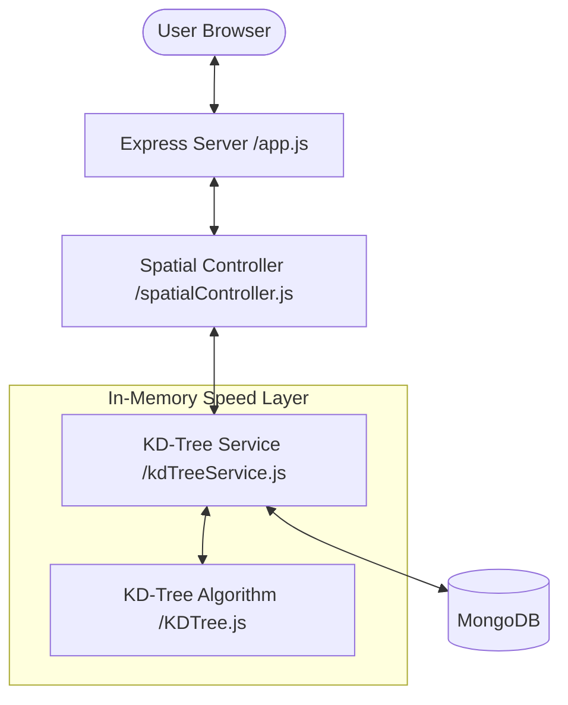

# 📖 Project Architecture: How It All Works

This document explains the architecture and logic of the **KD-Tree Spatial Query Handler**. Think of it as the "behind-the-scenes" guide to the project.

---

## 🏗️ System Architecture

The project follows a standard layered architecture, but with a unique **In-Memory Cache (KD-Tree)** for ultra-fast spatial searches.

---

## 🧩 Core Components

### 1. The Entry Point: [server.js](./src/server.js)
This is where the engine starts. It does two critical things before accepting requests:
- Connects to **MongoDB**.
- Tells the `kdTreeService` to **build the initial tree**. This fetches all points from the DB and loads them into memory.

### 2. The Algorithmic Heart: [KDTree.js](./src/kdtree/KDTree.js)
This is the most advanced part of the project. It organizes points in a 2D tree:
- **Splitting**: It sorts points by Longitude (level 0), then Latitude (level 1), and picks the **median** point to split the space into two halves (Left/Right).
- **Recursion**: It repeats this until every point is placed in a balanced tree.
- **Why?**: Instead of checking *all* 10,000 points in a database, it can find neighbors by only looking at a tiny fraction (~log N) of the tree.

### 3. The Singleton Manager: [kdTreeService.js](./src/services/kdTreeService.js)
This serves as the single source of truth. It holds the `tree` object in memory so that every API request uses the same lightning-fast index.

### 4. The Controller: [spatialController.js](./src/controllers/spatialController.js)
This is the "translator". It takes raw browser requests (like `?lat=40&lng=-73`), converts them to numbers, calls the Service, and returns the result as JSON.

---

## 🔄 The Life of a Query

When you search for "Nearest Neighbors" on the map:

1.  **Frontend**: Sends a `GET` request to `/api/spatial/nearest?lat=...&lng=...`.
2.  **App/Routes**: Directs the request to the `nearestNeighborQuery` in the controller.
3.  **Controller**: Extracts coordinates and asks the **Service**.
4.  **Service**: Executes the `KDTree` logic in memory. It traverses the tree, pruning branches that are too far away to matter.
5.  **Result**: The closest points are sent back in milliseconds—no slow database disk reads involved!

---

## 🛠️ Maintenance & Versioning

- **Seeding**: The `seed.js` script populates MongoDB with real-world New York coordinates so the tree has something to index.
- **Balancing**: If you add many new points to the DB, the tree might become "unbalanced". The `rebuild` endpoint (and scripts) triggers a fresh split-by-median rebuild to restore peak performance.

---

> [!TIP]
> **Why use this instead of MongoDB's built-in `$near`?**
> While MongoDB is great for persistence, an in-memory KD-tree is significantly faster for high-concurrency systems where low-latency spatial queries are critical (like ride-sharing or real-time gaming).
